<!-- ============== Hero (custom animated SVG) ============== -->

<!-- ============== Typing rotator ============== -->

  

 

<!-- ============== About card ============== -->
> **🎓 Bachelor student** in **AI Computer Engineering** at **Kyonggi University** — GPA **4.49 / 4.5**
>
> **🔭 Currently** working on deepfake detection ([**ISEEYOU**](https://github.com/jeehun3020/ISEEYOU_MODEL)) and an [**interactive portfolio site**](https://jeehun3020.github.io)
>
> **🌱 Learning** vision-language multimodal models &amp; on-device AI
>
> **💼 Open to** research collaboration — feel free to reach out

 

<!-- ============== Tech Stack ============== -->
<h3>🛠 &nbsp;Tech Stack</h3>

  
  
  
  &nbsp;
  
  
  
  
  
  
  &nbsp;
  
  
  
  
  
  

 

<!-- ============== Featured Projects ============== -->
<h3>📌 &nbsp;Featured Projects</h3>

<table>
  <tr>
    <td width="50%" valign="top">
      <a href="https://github.com/jeehun3020/airbender">
        <h4>🛰️ &nbsp;AIRBENDER</h4>
      </a>
      NASA TEMPO 위성 데이터 기반 대기질 예측 시스템. 위성·기상 데이터 융합, Vertex AI 오존 예측, LLM 개인 알림.
      

        
        
        
      

    </td>
    <td width="50%" valign="top">
      <a href="https://github.com/jeehun3020/FocusAI">
        <h4>🎯 &nbsp;FocusAI</h4>
      </a>
      지능형 독서실 표정·행동 분석 학습 집중도 시스템. 안구 폐쇄·하품·머리 움직임 검출, 집중도 스코어 산출.
      

        
        
        
      

    </td>
  </tr>
  <tr>
    <td width="50%" valign="top">
      <a href="https://github.com/jeehun3020/ISEEYOU_MODEL">
        <h4>🕵️ &nbsp;ISEEYOU</h4>
      </a>
      딥페이크 영상 탐지 캡스톤 — 클린 비디오 프로토콜 + ConvNeXt verifier.
      

        
        
        
      

    </td>
    <td width="50%" valign="top">
      <a href="https://github.com/jeehun3020/FocusDrive">
        <h4>🚗 &nbsp;FocusDrive</h4>
      </a>
      실시간 운전자 졸음 감지 시스템 — OpenCV 프레임 캡처, AutoML 분류, 즉시 음성 알림.
      

        
        
        
      

    </td>
  </tr>
  <tr>
    <td colspan="2" valign="top">
      <a href="https://jeehun3020.github.io">
        <h4>🌐 &nbsp;jeehun3020.github.io — Interactive Portfolio</h4>
      </a>
      이 README와 동일한 인디고/퍼플 톤 · 마우스 스포트라이트 · 타이핑 인트로 · 카운터 애니메이션 · 3D 틸트 카드.
      

        
        
        
      

    </td>
  </tr>
</table>

 

<!-- ============== Stats (theme-adaptive, indigo-tuned) ============== -->
<h3>📊 &nbsp;GitHub Stats</h3>

  <picture>
    <source media="(prefers-color-scheme: dark)"
            srcset="https://github-readme-stats.vercel.app/api?username=jeehun3020&show_icons=true&hide_border=true&include_all_commits=true&count_private=true&bg_color=00000000&title_color=a78bfa&icon_color=c4b5fd&text_color=cbd5e1&card_width=460" />
    
  </picture>
  <picture>
    <source media="(prefers-color-scheme: dark)"
            srcset="https://github-readme-stats.vercel.app/api/top-langs/?username=jeehun3020&layout=compact&hide_border=true&langs_count=8&bg_color=00000000&title_color=a78bfa&text_color=cbd5e1&card_width=380" />
    
  </picture>

 

<h3>🔥 &nbsp;Streak</h3>

<picture>
  <source media="(prefers-color-scheme: dark)"
          srcset="https://github-readme-streak-stats.herokuapp.com/?user=jeehun3020&hide_border=true&background=00000000&stroke=a78bfa&ring=a78bfa&fire=c4b5fd&currStreakNum=a78bfa&sideNums=a78bfa&currStreakLabel=a78bfa&sideLabels=cbd5e1&dates=94a3b8" />
  
</picture>

 

<h3>📈 &nbsp;Recent Activity</h3>

<picture>
  <source media="(prefers-color-scheme: dark)"
          srcset="https://github-readme-activity-graph.vercel.app/graph?username=jeehun3020&hide_border=true&area=true&bg_color=0d1117&color=a78bfa&line=c4b5fd&point=ffffff&title_color=a78bfa&custom_title=Contribution+Activity+(31d)" />
  
</picture>

 

<h3>🐍 &nbsp;Contribution Snake</h3>

<picture>
  <source media="(prefers-color-scheme: dark)"
          srcset="https://raw.githubusercontent.com/jeehun3020/jeehun3020/output/github-contribution-grid-snake-dark.svg" />
  
</picture>

📝 Daily-regenerated by <a href="https://github.com/Platane/snk">Platane/snk</a> via <code>.github/workflows/snake.yml</code>. Appears once the workflow has run for the first time.

  

<!-- ============== Connect ============== -->
<h3>🤝 &nbsp;Connect</h3>

  
  
  

 

<!-- ============== Footer ============== -->

  
    
  <i>"Building efficient AI systems that transform complex visual data into practical value."</i>

